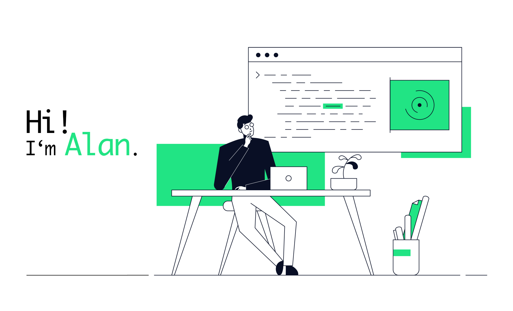

</html>

---

  

  

### 👋 Hi, I'm Alan

Project Coordinator at Voi Technology  
Learning and building in web development

🔗 Latest project: [PatioPal](https://patiopal-app.vercel.app)

### :fire: My Stats :

<!--
**tonelloalan/tonelloalan** is a ✨ _special_ ✨ repository because its `README.md` (this file) appears on your GitHub profile.

- 🌱 I’m currently learning HTML, CSS and Javascript

-->
