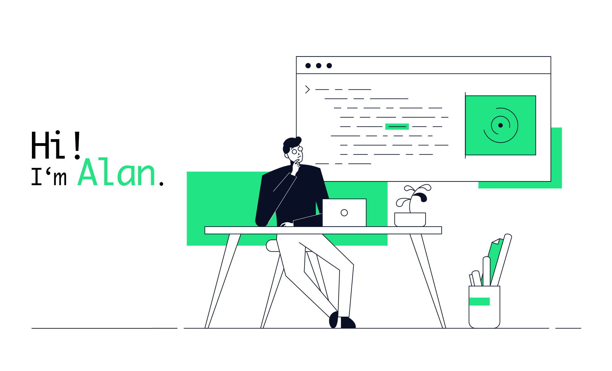

  

    

</html>

---

  

### 👨‍💻 About Me :

Brazilian-born, Berlin-based web developer with a background in film studies and production. Passionate about creating visually engaging and user-friendly web experiences. Skilled in HTML, CSS, JavaScript, React.js, Node.js, and Git/GitHub. Always learning and excited to collaborate! 🚀

### 🛠️ Skills & Projects

Languages: HTML, CSS, JavaScript
Frameworks/Libraries: React.js
Back-end: Node.js
Tools: Git/GitHub, Database Management (feel free to specify software here if you like)
Projects: (Link to 1-2 key projects from your portfolio)

### 🎬 Creative Background

My experience in film/video production, graphic design, and photography informs my approach to web design, ensuring a strong focus on visual storytelling and aesthetics.

Let's connect and build something great!

### :fire: My Stats :

<!--
**tonelloalan/tonelloalan** is a ✨ _special_ ✨ repository because its `README.md` (this file) appears on your GitHub profile.

- 🌱 I’m currently learning HTML, CSS and Javascript

-->
